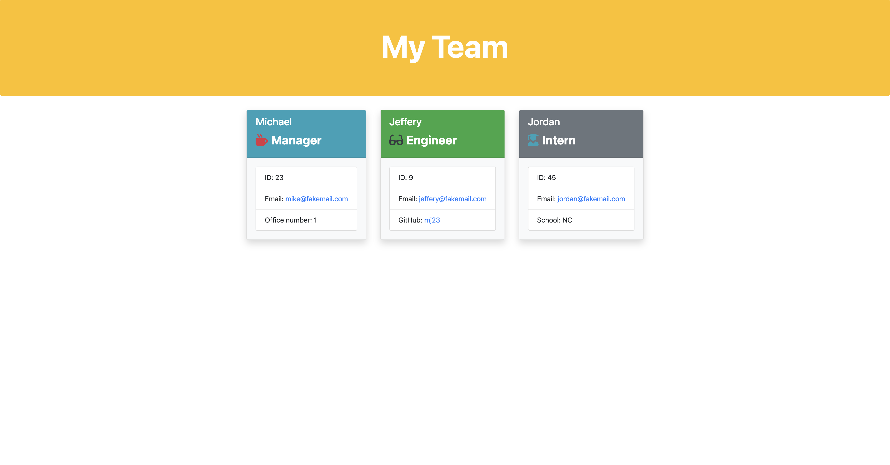

# Team Generator

> This web app creates an html file with team members based on user input.

### Table of Contents

- [Description](#description)
- [Installation](#installation)
- [Technologies](#technologies)
- [How To Use](#how-to-use)
- [Links](#links)
- [Author Info](#author-info)

---

## Description
In this web application, the user runs the command line, types in 'node app.js' and is asked a series of questions. These answers are then stored and printed to an html file called 'team.html'  in the output folder.From there the user can view the generated file in the browser.  

---

## Installation
This app requires Node.js, npm inquirer, jest, npm util.

---
[Back To The Top](#read-me-template)

## Technologies
HTML, Bootstrap, JavaScript, Node.js, NPMs.

[Back To The Top](#read-me-template)

---

## How To Use
User must open 'team_Generator' folder in the command line. Then type the 'node app.js' command. Answer the proceeding questions. When done, close the terminal and open the 'output' folder in 'team_Generator.' Open the 
team.html file in user browser and view your team!
   
[Back To The Top](#read-me-template)
   
---

## Links

Link to video of how to operate:
https://github.com/deleonfrancis/team_Generator/blob/main/assets/team_Gen_Video.mov
click download to view the video.

Link to GitHub repository:
https://github.com/deleonfrancis/team_Generator

[Back To The Top](#read-me-template)

---

## Author Info

- E-mail: dxfrancis.coding@gmail.com

[Back To The Top](#read-me-template)

---

## License

MIT
Copyright (c) 2021 Deleon Francis

Permission is hereby granted, free of charge, to any person obtaining a copy
of this software and associated documentation files (the "Software"), to deal
in the Software without restriction, including without limitation the rights
to use, copy, modify, merge, publish, distribute, sublicense, and/or sell
copies of the Software, and to permit persons to whom the Software is
furnished to do so, subject to the following conditions:

The above copyright notice and this permission notice shall be included in all
copies or substantial portions of the Software.

THE SOFTWARE IS PROVIDED "AS IS", WITHOUT WARRANTY OF ANY KIND, EXPRESS OR
IMPLIED, INCLUDING BUT NOT LIMITED TO THE WARRANTIES OF MERCHANTABILITY,
FITNESS FOR A PARTICULAR PURPOSE AND NONINFRINGEMENT. IN NO EVENT SHALL THE
AUTHORS OR COPYRIGHT HOLDERS BE LIABLE FOR ANY CLAIM, DAMAGES OR OTHER
LIABILITY, WHETHER IN AN ACTION OF CONTRACT, TORT OR OTHERWISE, ARISING FROM,
OUT OF OR IN CONNECTION WITH THE SOFTWARE OR THE USE OR OTHER DEALINGS IN THE
SOFTWARE.
